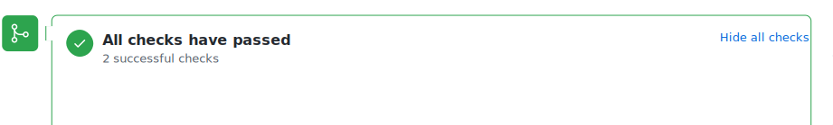
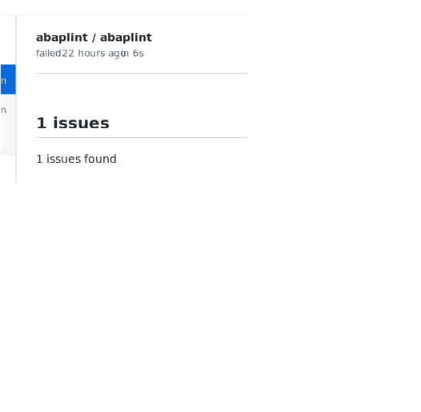

== Annotations

After installation and configuration of abaplint.app, it will report findings for each commit.

If issues are found, the "Details" link can be clicked, and the developer can check the findings directly in the pull request,

Annotations are updated after each push, and links directly to the branch which contains the change.

Additional information regarding the specific rules can be looked up on https://rules.abaplint.org