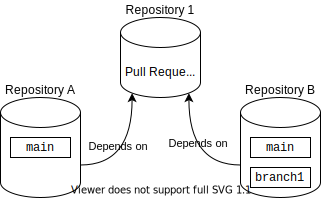

== Cross Check

Some applications consists of multiple components maintained by different teams. This abaplint.app feature allows to discover syntax errors across repositories before changes are merged, so that fixes can be prepared in due time.

All repository relations and branches are found and checked one by one. If the checked already have errors, it is skipped.

Public repositories consider only public dependencies, private will take repositories in the same organization into account.

The cross check feature is enabled by default, but only reported if there are any related repositories, the feature can be disabled in `abaplint-app.json` if needed.

If there are no errors found, success is reported as a status check on the pull request. In case of new errors, a neutral status is reported, click the link from the status check to see the overview of the results,

image::img/cross_check.svg[]

=== Example

A pull request is opened in "Repository 1", which have two dependent repositories: A and B,

The pull request will cross check all combinations,

* Repository A, branch `main` against the pull request
* Repository B, branch `main` against the pull request
* Repository B, branch `branch1` against the pull request
