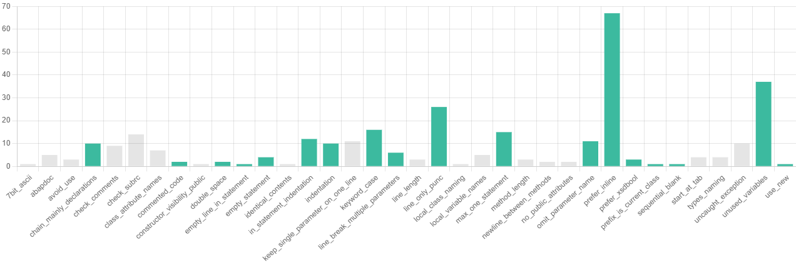
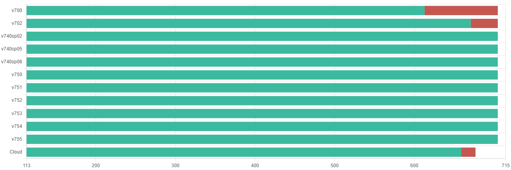
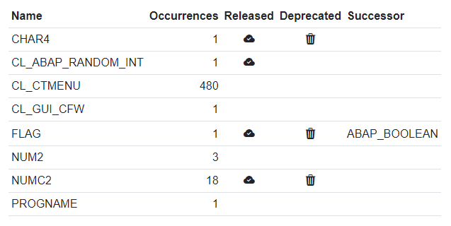
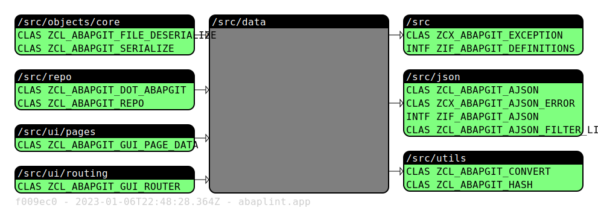
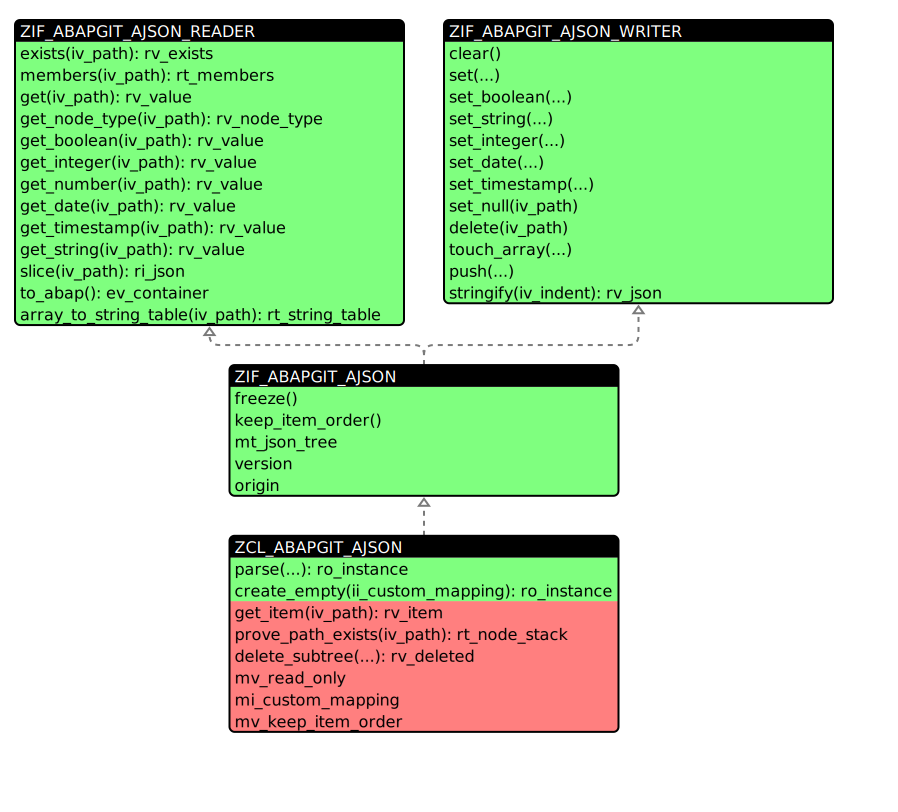
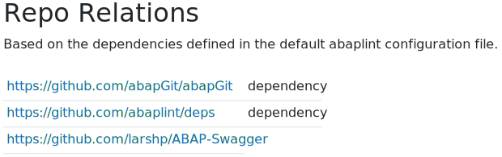

== Insights

Various code insights are automatically generated daily by abaplint.app, insights can be accessed via web.
Insights for public projects are public, users must login to access insights for private projects.
All insights are generated only for the default branch.

=== Issues
abaplint is run for the source code, if no configuration is present, the default configuration is used.
Issues are listed, plus a graph gives an overview, issues with quick-fixes are shown in green,

=== Method Length
Method length gives an overview of the method implementation lengths across the source code.
Note that the scale is logarithmic,

=== Method Complexity
Overview of method complexity measured as cyclomatic complexity.

=== Statement Compatibility
Statement parsing id performed against different language versions, this gives an overview of effort
required to downport or upport the codebase.

=== Void Types
Lists void types as per the `errorNamespace` configuration, along with release, deprecation and successor information.

=== Dependencies
Lists where dependencies are used in the codebase. Dependencies are configured in the `abaplint.json` file

=== Package Coupling
Given a folder(package) the diagram lists objects and packages using something in the package on the left side. The right side lists what is being used from the package.

Test class includes and dependencies are ignored. Dependencies into sub-folders are shown with blue background.

=== UML Class Diagrams
Provides auto generated UML diagrams for all global classes and interfaces, example:

=== Disabled Rules
If rules are disabled in the configuration, abaplint.app will try to enable to rule and provide the issue count and how much is quick-fixable.

=== Repository Relations
Dependencies from the abaplint configuration file is listed,

