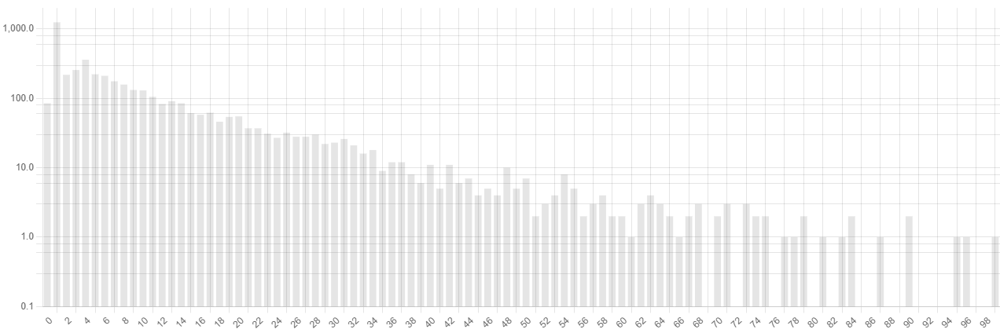

== Insights

Various code insights are automatically generated daily by abaplint.app, insights can be accessed via web.
Insights for public projects are public, users must login to access insights for private projects.
All insights are generated only for the default branch.

=== Issues
abaplint is run for the source code, if no configuration is present, the default configuration is used.
Issues are listed, plus a graph gives an overview, issues with quick-fixes are shown in green,

image::img/issues.png[]

=== Method Length
Method length gives an overview of the method implementation lengths across the source code.
Note that the scale is logarithmic,

=== Method Complexity
Overview of method complexity measured as cyclomatic complexity.

=== Statement Compatibility
Statement parsing id performed against different language versions, this gives an overview of effort
required to downport or upport the codebase.

=== Void Types
Lists void types as per the `errorNamespace` configuration, along with release, deprecation and successor information.

image::img/void_types.png[]

=== Dependencies
Lists where dependencies are used in the codebase. Dependencies are configured in the `abaplint.json` file

=== Package Coupling
Given a folder(package) the diagram lists objects and packages using something in the package on the left side. The right side lists what is being used from the package.

Test class includes and dependencies are ignored. Dependencies into sub-folders are shown with blue background.

image::img/package_coupling.svg[]

=== UML Class Diagrams
Provides auto generated UML diagrams for all global classes and interfaces, example:

=== Disabled Rules
If rules are disabled in the configuration, abaplint.app will try to enable to rule and provide the issue count and how much is quick-fixable.

=== Repository Relations
Dependencies from the abaplint configuration file is listed,

=== Lines Over Time
Show codebase size over time,

=== Unit Tests
Show number of unit tests over time,

=== Lines vs Unit Tests
Show number of lines compared to number of unit tests over time,

=== Average Complexity
Show average cyclomatic complexity over time

=== Average Method Length
Show average method length over time, measured in number of statements

image::img/average_method_length.png[]

=== Target Rules

See the Target Rules chapter

=== Class Length

Find the latest classes in the codebase, these are good candidates for refactoring.

=== Intra Class Call Graph

Display relations between methods internally in a class. The diagram does not reflect sequence, only if a method is called from another method.
Only static method references are displayed.

=== Object Types

Overview of how many objects of each type exists in the repository.
Cloud indicates the object type is possible in ABAP Cloud, not that the actual object contents works in ABAP Cloud.

