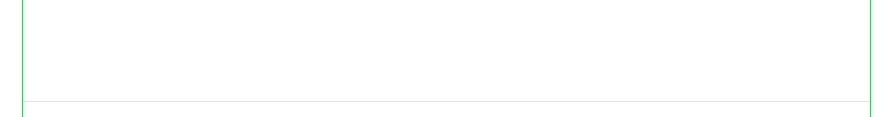

== Observations

Observations are run only in the context of a pull request, and reports only "success" or "neutral" run status, so it will not block merges in case link:https://docs.github.com/en/github/administering-a-repository/defining-the-mergeability-of-pull-requests/about-protected-branches#require-status-checks-before-merging[required checks] are setup for branch protection.

If there are zero observations the step reports success, if some are found it reports the neutral status. A neutral status is shown in the pull request, which help s the reviewer to identify and check the observations.

For running examples see pull requests for the following repositories, link:https://github.com/heliconialabs?q=observation[https://github.com/heliconialabs?q=observation]

=== New void type used

If abaplint is configured with `errorNamespace` some types are trusted by abaplint to be correct in all uses, these types are called void types.

This observation reports findings if new void types are introduced by the pull request, this helps identifying if the footprint towards eg. dependencies or the standard system increases.

=== DB field changed

Changing structures, data elements or domains can cause transparent database tables to be changed, this observation helps making these changes visible to reviewers.

This observation is reported if:

* If the type of a field is changed
* If a field is added
* If a field is removed
* If a key field is added
* If a key field is removed

=== Target Rules

Rules configured as `targetRules` will show up as observations, see the chapter on Target Rules.

=== Parallel File Changes

If identical file names are changed in more than one open pull request is reported it will trigger an observation.

Git will do its best to merge the changes, however it can be troublesome to deploy these changes to the landscape simultaneously.