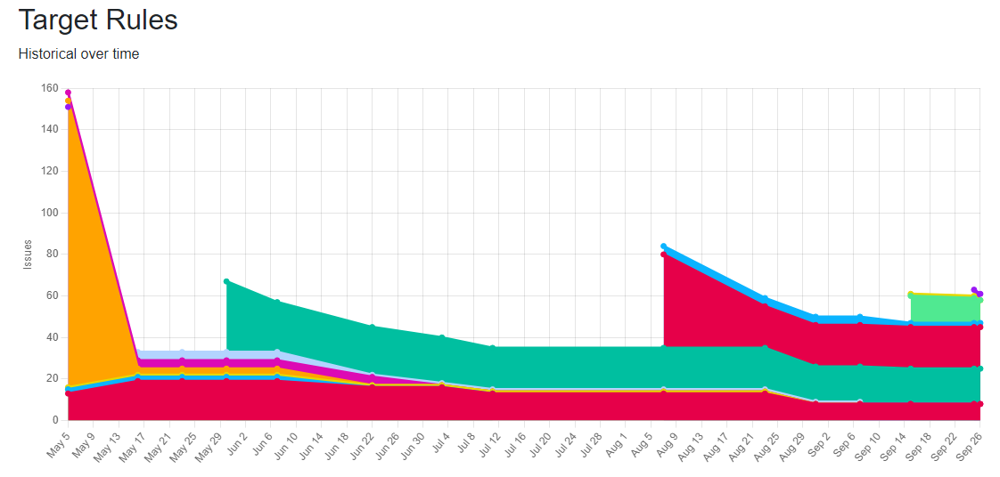

== Target Rules

Target rules are configured in the normal `abaplint.json` file, these rules does not set failed status, but instead allows pull requests to be merged. The target rules findings shows up as observations.

This is useful for moving the code in a better direction when its convenient. The developer and reviewer will both see the observations in the pull request status, and decide if to fix or defer. Deferring is useful for critical/complex changes, but many scenarios also allow for gradually performing fixes to move to a better target.

=== Configuration

The target rules can be defined after the normal `rules`, using the link:https://marketplace.visualstudio.com/items?itemName=larshp.vscode-abaplint[vscode abaplint extension] will help with validation and intellisense.

[source,json]
----
{
  ...
  "rules": {
    ...
  },
  "targetRules": {
    "double_space": true,
  },
}
----

=== Insights

The team can always check up on the direction the code is moving. Perhaps moving some rules to required, or adding additional, or even removing if the code is not moving as first intended.

Spikes will happen when enabling additional target rules.